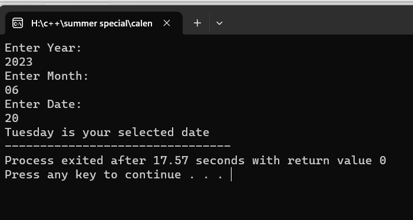

# Calender
code for week of the day for Non_leap year

Pre-requisites
--------------

- C++
## Demo

## Features

- It will give the week of the day - 

## Authors

- [@hemu33662](https://github.com/hemu33662)
